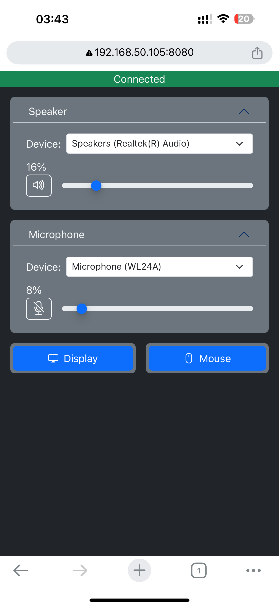
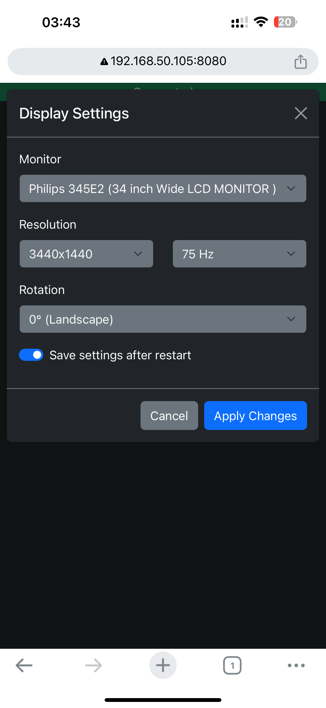
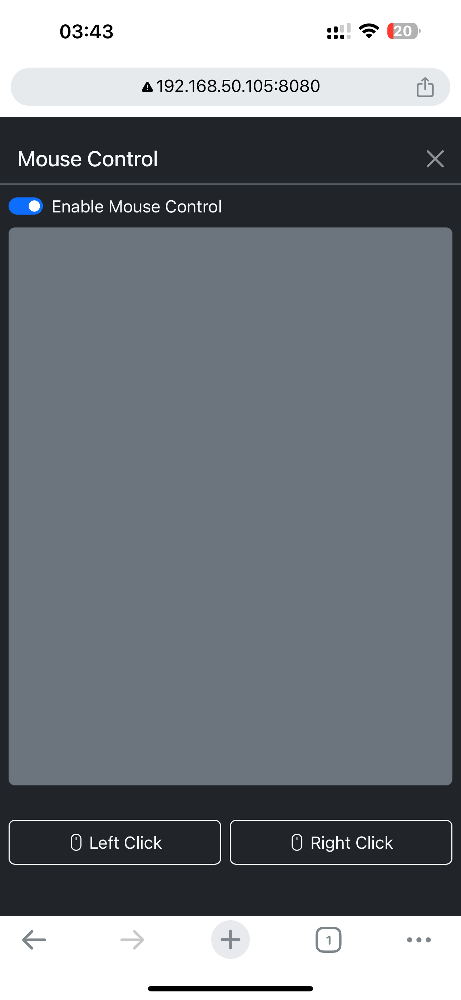
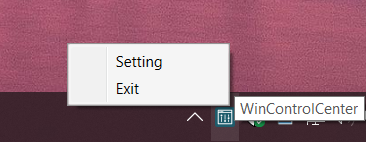
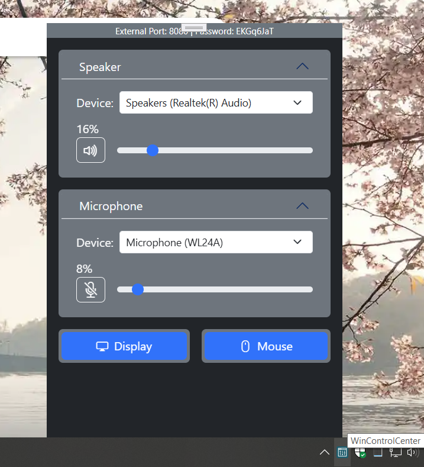
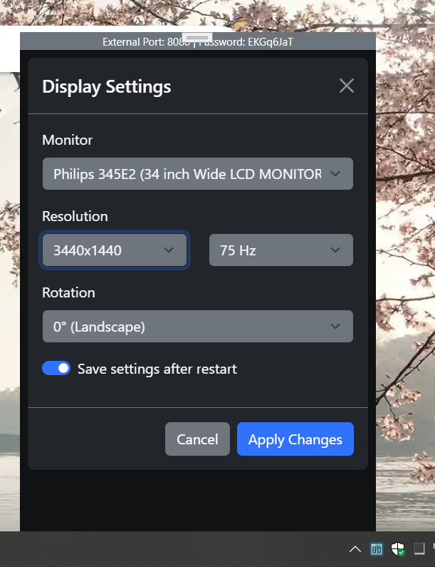
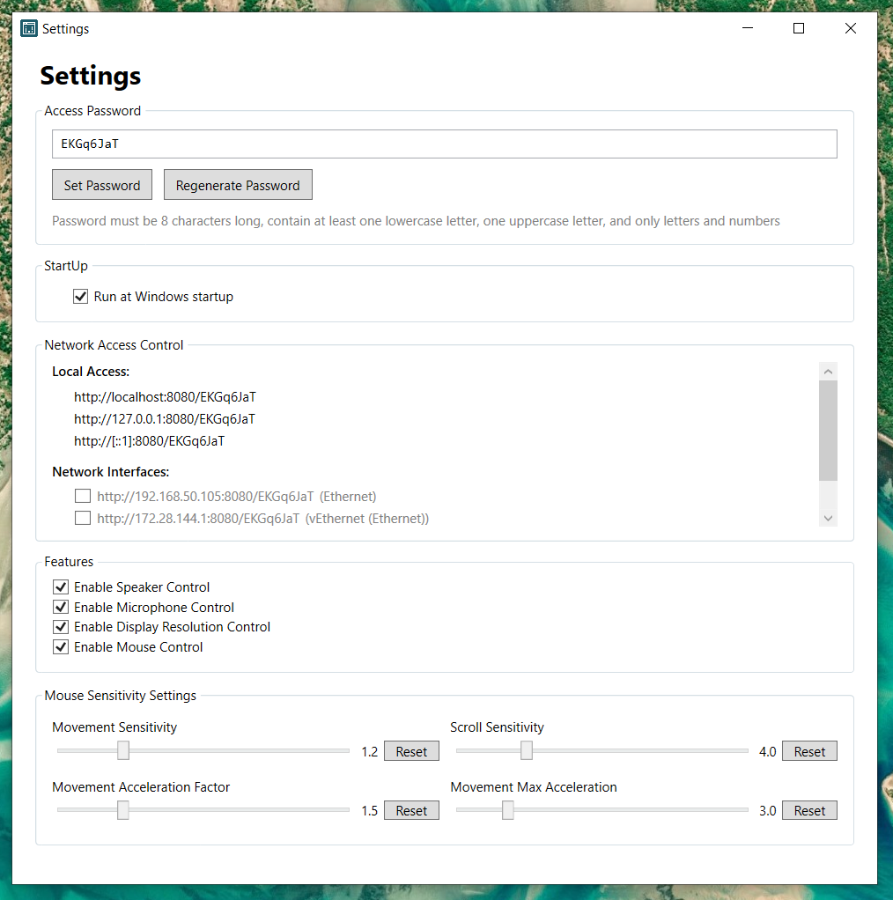

# WinControlCenter

Control your Windows PC remotely from any browser in your Local Network, even on phones and pads.
Change Resolution/Volume/Device without going into multiple pages of Windows settings.

### Phone Screenshot

</img> </img> </img>

### Windows Screenshots

</img>

</img> </img>

## Features
- #### All settings in one location (Tray Icon)
- **📱 Simple Control on mobile and tablets**
- **🔊 Audio Control**
- **🖥️ Display Control**
- **🖱️ Mouse Control**
- **🔒 Secure Access**
- **🚀 Zero Installation, No external internet connectivity required**

## Perfect for...

- 📺 Watching movies from PC in your couch - Remotely change volume or click the screen
- 🎮 Streaming when gaming - you need quick access to system controls and not blocking your screen
- 🖥️ Multi-monitor workstations requiring frequent display adjustments
- 🎵 Audio adjustments during presentations or meetings

##
##  Getting Started
#### For Windows:
1. Download the latest release and extract the zip
2. Run WinControlCenter.exe
3. Double-click the tray icon for local control
 
#### For phone control:
1. Go to Settings by Right Click on the tray icon
2. Enable your preferred local LAN access (Settings are saved to WinControlCenter.Setting.xml)
     
1. Access the control panel from any device on your network using the provided URL

## 💻 System Requirements

- Windows 10/11+ (Also tested on Windows 10 IoT Enterprise LTSC Version)

- If you want remote control:
  - Modern web browser on client devices
  - Local network connection

## Current limitation

#### Does not support keyboard input
#### Does not support https/wss 
#### Does not support mouse "click and drag"

## 🤝 Contributing and support

Contributions are welcome! Feel free to:

- Report bugs
- Suggest new features
- Submit pull requests
- Improve documentation
- Starring the repository
- Sharing with friends and colleagues

- Email: contact@zenqlo.com

## 📜 License

This project is licensed under the MIT License - see the [LICENSE](LICENSE) file for details.

